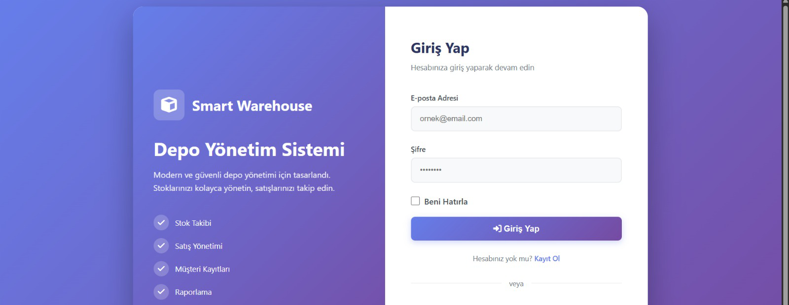
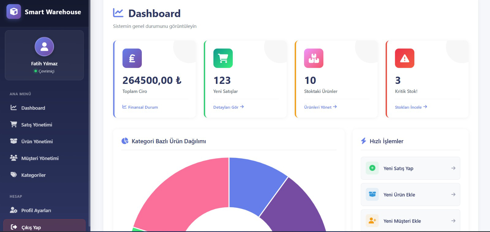

# 📦 SmartWarehouse

## Yapay Zeka Destekli Stok & Satış Takip Sistemi

SmartWarehouse, geleneksel stok ve satış takibini **yapay zeka** ile birleştiren, **ASP.NET MVC** mimarisi üzerine kurulu modern ve güvenli bir depo yönetim sistemidir.

Modern ve kullanıcı dostu arayüzü sayesinde;

* Stoklarınızı kolayca yönetebilir,
* Satışlarınızı anlık olarak takip edebilir,
* Yapay zeka destekli tahminlerle **veriye dayalı kararlar** alabilirsiniz.

---

## 📸 Ekran Görüntüleri

### 🔐 Giriş Ekranı



### 📊 Yönetim Paneli (Dashboard)



---

## 🚀 Öne Çıkan Özellikler

### 🧠 1. Yapay Zeka (AI) Entegrasyonu

Bu projenin en güçlü yönü, **kendi kendini eğitebilen yapay zeka modülüdür**.

* **Algoritma:** Microsoft **ML.NET** kütüphanesinin **FastTree Regression (Karar Ağacı)** algoritması kullanılmıştır.
* **Dinamik Öğrenme:** Sistem her **20 yeni satışta bir** (veya manuel tetikleme ile) modeli yeniden eğitir.
* **Stok Tahmini:** Tarihsel satış verilerine göre **gelecek ayın satış adedini** tahmin eder.
* **Akıllı Uyarı:** Eğer **Tahmin Edilen Satış > Mevcut Stok** ise sistem dashboard üzerinde **Kritik Stok** uyarısı verir.

---

### 📊 2. Gelişmiş Dashboard

* Toplam ciro, günlük satış sayısı, ürün adedi ve kritik stok sayısı anlık gösterilir
* **Chart.js** ile grafiksel raporlama
* Hızlı satış, ürün ve müşteri işlemleri

---

### 🛠 3. Yönetim Modülleri

* Ürün & kategori yönetimi (SOLID prensiplerine uygun yapı)
* Satış yapıldığında stoktan otomatik düşme
* `[Authorize]` ve `ValidateAntiForgeryToken` ile güvenlik

---

## 💻 Kullanılan Teknolojiler

* **Backend:** C#, ASP.NET MVC 5
* **Veritabanı:** MS SQL Server, Entity Framework 6
* **Yapay Zeka:** Microsoft ML.NET (FastTree Regression)
* **Frontend:** HTML5, CSS3, Bootstrap, JavaScript, Chart.js
* **IDE:** Visual Studio 2022

---

## ⚙️ Kurulum ve Çalıştırma

### 1️⃣ Repo’yu klonlayın

```bash
git clone https://github.com/fthtna/SmartWarehouse.git
```

### 2️⃣ Veritabanı ayarları

* `Web.config` içindeki **connectionString** alanını kendi SQL Server bilginize göre düzenleyin
* `.sql` scriptini çalıştırın veya EF Migration kullanın

### 3️⃣ ML.NET hatası alırsanız

```powershell
Update-Package -Reinstall
```

### 4️⃣ Projeyi çalıştırın

* Visual Studio’da **F5** ile başlatın
* Kayıt olup sisteme giriş yapabilirsiniz

---

## 🧪 Yapay Zeka Test Senaryosu

1. Farklı satış hacmine sahip ürünler ekleyin
2. Web arayüzünden satış yapın
3. Model otomatik güncellenir
4. Dashboard’da **Gelecek Ay Tahminleri** görüntülenir

---

## 📝 Lisans

Bu proje **üniversite bitirme projesi** kapsamında geliştirilmiştir. Eğitim amaçlı kullanılabilir.
